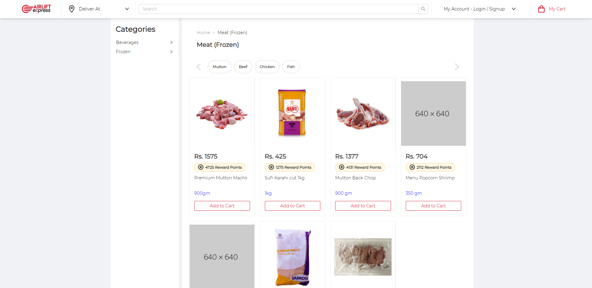
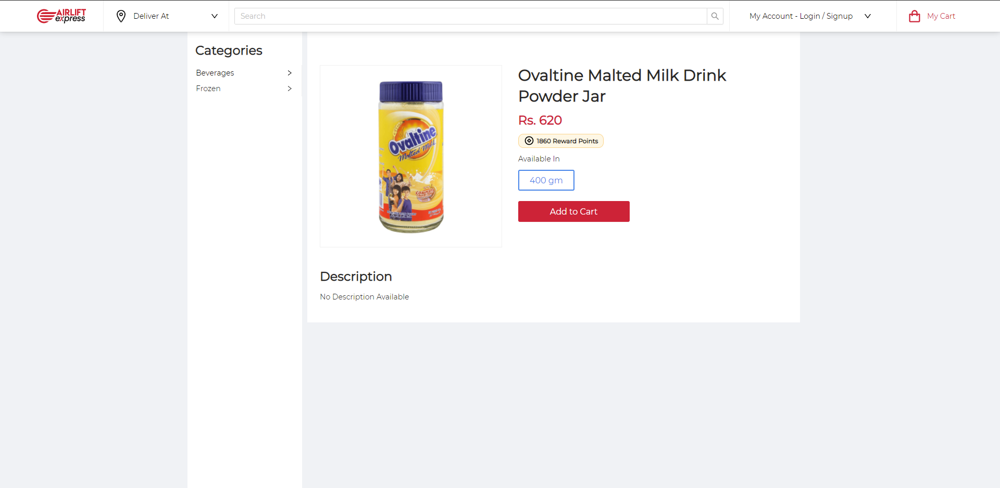

# Airlift Frontend Case Study Assessment

## Steps followed to complete assessment

1. Bootstrapped create-react-app typescript template and pushed to github repo.
2. Integrated Ant design for faster development pace.
3. Built a wrapper layout component.
4. Built Reusable components for,

- Product Card
- Products
- Product Detail
- And much more atomic components

5. Restructured React app for better code management.
6. Styled the app using **SCSS**

## How to run assessment

1. Clone the repo using https.
2. Add **.env.development.local** file to the root and add your API config like **REACT_APP_AIRLIFT_API_ADDR = 'https://storeapi.airliftgrocer.com/'** as exactly mentioned.
3. Run `npm install` to install all the dependencies.
4. Run `npm run start` to execute project in development mode.

## Disclaimer

- Did not cater for responsiveness as it was not a functional requirement.
- All non-functional requirements are followed.

> What improvements can be made

- This UI seems to have some bugs, i.e. if you search for a product, some of them you cant click on to open detail page.
- There was no alternate image for product images, if there was no image. I added a dummy fallback image.
- A lot of products do not have any description which makes the UI lack good user experience. Should tell the user that there is no description.
- There are issues with APIs, it does not always fetches the specified amount of products per page instead it is built for something like infinite scroll.

## Screenshots

- Product Listing
  

- Product Detail
  
